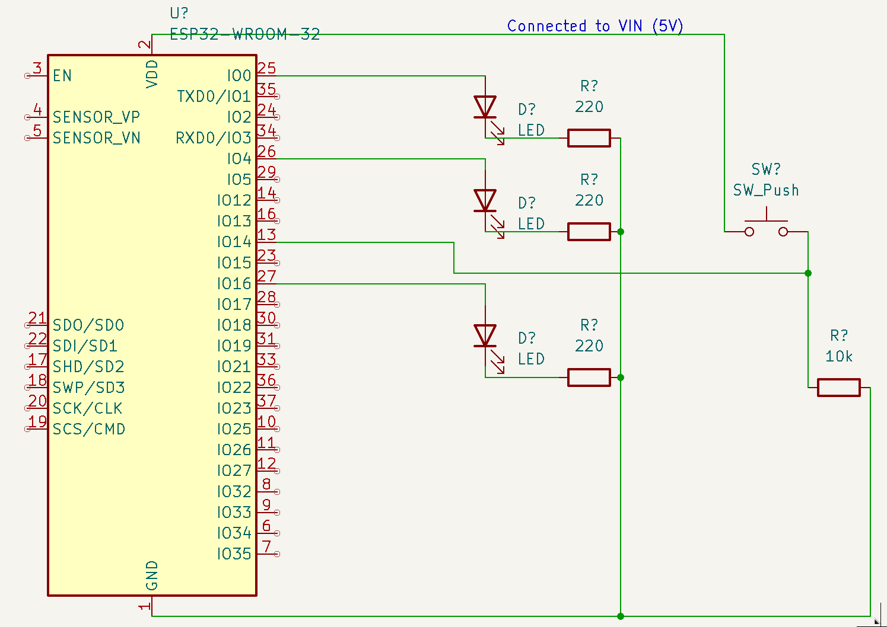
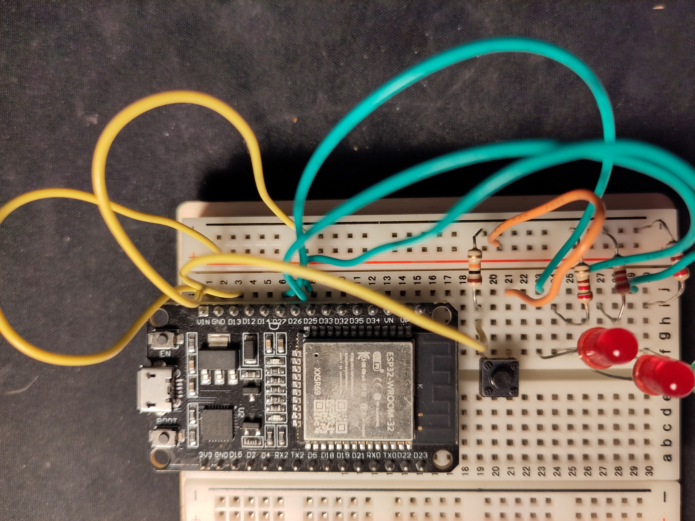

# Spaceship interface

This is an implementation of Arduino Projects Book (2012-2013) project Spaceship interface (pages: 32-40) with ESP32-WROOM-32 and ESP-IDF Framework.

## Schematic

This was my first time using KiCad so feel free to correct me if something is wrong.

## How it looks

Here is how it looks irl.

